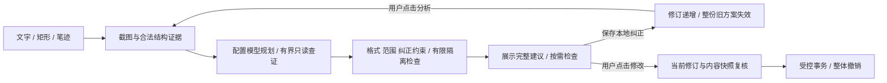

# Markset 可检查可纠正的关系性笔迹网页编辑 UIST论文工作稿

**UIST 论文工作稿，更新于 2026 年 10 月 8 日。** 研究主线是可检查、可纠正的关系性笔迹编辑：用户不仅标记对象，还表达对象之间的关系，并能在应用前纠正系统的指代。Markset 已实现表单式对象、角色、唯一文字范围及相对放置关系纠正，以及整份旧方案失效、主动重新分析和可逆应用。当前没有完整可拖拽关系图或精细步骤依赖证明；正式参与者研究尚未开展。下文区分已实现机制、受控工程测试和待检验的效益。

**英文题目：** *Markset: Inspectable and Correctable Relational Marks for Local Web Editing*

## 摘要

在已有网页上增加配图、重排对象或组合修改时，圈选内容可能是修改目标，也可能只是应保留的语义上下文；另一处空白框或箭头可能指定结果位置。将这些标记逐个映射为固定命令，难以表达它们共同构成的编辑关系。本文介绍 Markset 的可检查、可纠正关系性笔迹编辑原型：结合原始笔迹、截图及页面结构，显示方案的改动对象和放置锚点，并通过按需展开的表单纠正对象层级、参考与保留角色、唯一文字片段及相对放置关系。纠正改变解释版本，使整份旧方案失效；重新分析与最终应用均由用户主动触发，执行仍受局部约束和整体撤销保护。原型及对照试跑工具已经实现，受控测试验证了部分状态和执行契约，但尚无参与者效果数据。本文将输入表达、结构证据增强和直接纠正分成独立比较，研究关系性标记何时帮助表达、检查与恢复，以及这些收益是否值得额外的交互和等待成本。

**关键词：** 关系性笔迹；直接操作；视觉指代；人机 AI 协作；局部网页编辑；错误恢复

## Abstract

Editing an existing web page often requires communicating relationships among objects rather than selecting a single target. A circled module may provide context to preserve, while a blank box or arrow refers to a different placement. We present Markset, a prototype for inspectable and correctable relational marks in imported HTML snapshots. Its on-demand, form-based inspector exposes planned write targets and placement anchors and supports correcting object bindings, reference and preservation roles, unique text spans, and relative placement. A correction advances the binding revision and conservatively invalidates the entire old plan; replanning and application require explicit user actions. The prototype combines multimodal evidence, constrained planning, limited isolated execution checks, and grouped undo. It does not implement a draggable relation graph or prove step-level dependency independence. Controlled engineering tests exercise parts of these contracts, not human effectiveness. We provide pilot-ready input conditions, controlled error fixtures, local consented logging, and independent scoring aids. Separate studies of input expression, structural evidence enrichment, and direct correction remain to be conducted. We treat reduced expression and recovery costs as hypotheses, without assuming that free-form marks benefit every task.

## 1 引言

网页已经存在，用户希望保留大部分内容，仅在局部实现一个新效果：把卡片移到另一张之前，在说明旁补图，或同时强调标题并增加相关内容。这类请求不只有“哪个对象要改”，还包括对象之间的顺序、归属、相对位置与保留关系。用户看得到这些关系，却未必知道相应的 HTML 层级或布局实现。

自然语言使用户能够描述目标，却不天然解决视觉指代。例如，“给这里加一张相关图片”至少包含三个尚未绑定的信息：这里指的是文字对象还是整个模块，图片应插在什么位置，以及哪些原有内容不能被替换。已有研究讨论了提示交互中的目标构想与结果评估困难，以及终端用户表达与模型可处理描述之间的抽象差距。网页的对象层级和空间关系进一步增加了这种转译负担。[1](https://doi.org/10.1145/3613904.3642754) [2](https://lxieyang.github.io/assets/files/pubs/llmgam-chi-2023/llmgam-chi-2023.pdf)

原位笔迹可以让用户在页面上同时指出内容与关系，但被圈住并不等于要被替换。例如，圈住训练说明并在右侧画一个图框，可能表示“以这段说明为主题，在右侧补图，保留说明”，而不是“把圈住的文字改成图片”。一次误解可能分别发生在对象层级、标记角色或放置关系上；用一句泛化建议或一个固定操作按钮，难以让用户准确发现错误发生在哪一层。

本研究将这类多对象、跨层级的请求称为关系性编辑，提出让笔迹解释成为可检查和可直接纠正的交互对象。用户首先表达目标，系统随后显示“参考了什么、改动什么、放在哪里、保留什么”；若系统误把模块认作标题，或误把参考文字认作替换目标，用户可以纠正这一绑定，而不是重新画全部笔迹或重写整段要求。修正解释不等于自动授权应用，旧方案也不能只替换一个节点 ID 后继续执行。

笔迹与 AI 的结合、解释反馈、影响范围提示和用户确认均已有直接先例。Code Shaping 已显示笔迹解释、相关代码及潜在影响范围；SketchGPT 已利用界面上下文提供工具感知反馈和人类确认。[7](https://www.wvisdomlab.com/papers/code-shaping.pdf) [8](https://orca.cardiff.ac.uk/id/eprint/181362/) 因而，仅把这些功能迁移到网页不足以构成本文的贡献。待检验的区别在于：渲染网页中字符、对象、模块与空白锚点的角色及关系，能否被统一检查和直接纠正，并与仍然有效的局部方案绑定。

本稿围绕三项候选研究贡献组织。第一，提出区分参考实体、实际写入、放置关系和保留约束的概念表示，并说明它与当前受控方案及纠正规范的对应。第二，实现按需检查和表单式直接纠正，纠正后保守地使整份旧方案失效，保持主动重新分析、确认与整体撤销。第三，提供把输入表达、结构证据增强与错误恢复分开的可复现试跑设计和工具。实现与工程测试已具备；其新颖性差异仍需逐项核验，交互效益必须由尚未开展的对照研究确立。

## 2 相关工作

### 2 1 直接操作与交互增强指令

DirectGPT 将直接操作原则引入大语言模型交互，通过对象表示、命令复用、组合操作与撤销，使用户不必完全依赖聊天输入。[3](https://damienmasson.com/pdfs/directgpt.pdf) Interaction-Augmented Instruction 则讨论提示、交互和内容对象如何共同构成面向生成式 AI 的指令。[4](https://arxiv.org/abs/2510.26069) 两者为 Markset 提供了一个基本立场：页面上的操作不是文字提示之外的附属装饰，而可以承担指代、约束和关系表达。

早期研究也说明笔迹与选择并非新出现的交互资源。PapierCraft 探索了交互式纸张上的手势命令；cTed 研究网页内容的选择机制。[5](https://doi.org/10.1145/1314683.1314686) [6](https://doi.org/10.1145/2851581.2892553) 因此，Markset 需要回答的不是“选择是否有用”，而是自由笔迹相对于同样支持多区域的常规选择，是否带来更丰富的关系表达，以及这种收益是否抵消绘制与等待成本。

### 2 2 非正式笔迹与多模态意图理解

Code Shaping 使用自由笔迹进行代码编辑，并在提交前提供笔迹解释、推断动作以及相关和潜在受影响代码的反馈。其设计已涉及解释检查与用户迭代，不能将“显示 AI 看懂了什么”本身视为 Markset 的创新。[7](https://www.wvisdomlab.com/papers/code-shaping.pdf) SketchGPT 结合草图、语音和界面上下文，产生可执行的工具感知反馈并保留人类确认，说明开放的笔迹意图并不限于固定手势分类。[8](https://orca.cardiff.ac.uk/id/eprint/181362/)

AnnotateGPT 将笔迹连接到文档批注目的及用户核验。[9](https://vialab.github.io/AnnotateGPT/) Notational Animating 将非正式符号组织为 source、path、target 的中间表示，并提供原位反馈与可调控件；关系表示和可编辑解释已有明确先例。[10](https://arxiv.org/html/2603.06880v1) Markset 的候选机制因此不是首次结构化笔迹，而是把这条思路用于已有网页中参考内容与实际写入位置不重合、且修改必须保留周边内容的情况。

本文关注一个更窄的问题：一次标记跨越字符、对象、模块和空白位置时，用户如何纠正这些实体的绑定与角色，以及纠正如何约束已有计划。与近邻工作的区别需要落实到具体界面操作、表示和评估任务，不能仅以“具有 DOM”“支持撤销”或“支持组合操作”作创新性判断。对 SketchGPT 的机制概述依据公开摘要，不据此推断其缺少某种纠正能力。

### 2 3 既有内容的局部修改与用户决定权

Misty 通过交互式概念混合，把示例界面的选定方面融入已有 UI，并支持进一步细化。[11](https://arxiv.org/html/2409.13900v3) InkSync 支持可接受或拒绝的文本编辑，以及生成内容的核验和审计；其正式论文题名为 Beyond the Chat: Executable and Verifiable Text-Editing with LLMs，而不是自由手写笔迹识别系统。[12](https://people.ischool.berkeley.edu/~hearst/papers/laban_uist_2024.pdf) DocEdit-v2 研究多模态定位下的文档结构编辑，说明对象定位与编辑操作之间需要明确连接。[13](https://aclanthology.org/2024.emnlp-main.867/)

局部修改中的资源成功、执行成功与目标达成并不等价。生成一张正确图片仍可能放错模块，重排正确节点仍可能影响应保留的另一张卡片。本文把这些失败用作关系解释和恢复任务，而不是把生成模型或通用验证器列为新的研究贡献。

### 2 4 视觉指代与空间控制

Set-of-Mark Prompting 使用可指代的视觉标记增强区域定位；TRISHUL 关注屏幕区域及层级关系的理解。本文将两者分别按已核实的 2023 年和 2025 年预印本引用。[14](https://arxiv.org/abs/2310.11441) [15](https://arxiv.org/abs/2502.08226) SketchFlex 以区域草图支持图像生成中的空间和语义一致性。[16](https://arxiv.org/abs/2502.07556) 这些方法支持共享区域引用和空间证据的价值，但不自动证明网页插入位置正确，也不构成 Markset 区域编号的原创性依据。

综上，本文研究的是关系解释到局部执行之间的可纠正连接：可见的参考对象未必是写入对象，放置关系必须落到合法锚点，保留约束也必须随纠正保持有效。其价值需与同样具备反馈、确认和撤销的条件比较，不能以增加解释面板代替有效性证据。

## 3 关系性笔迹的表示与编辑约束

### 3 1 区分参考对象与改动对象

关系性笔迹指一组需要结合页面实体及其关系才能解释的标记，而不是一套新手势语法。用户可以圈、画框、点选位置或连箭头，也可以只提供文字；系统不能要求“圈必然删除”或“箭头必然移动”。本节用 V、E、G、W、K、B 解释设计逻辑，不声称后端已物化为统一完整关系图。当前实现分别使用页面观察、受控操作方案、区域绑定与放置纠正规范、修订号和内容快照承载这些信息。

一个参考实体可以是字符片段、DOM 对象、语义模块或空白放置锚点。每个实体保留来源标记、稳定页面引用、所属模块和观察版本。参考实体说明模型使用了什么证据；写入对象则明确哪些实体及属性可以改变。圈住一个模块可以只提供配图主题，不授权删除模块文本。

实体之间记录与本次目标有关的关系，例如“来自模块 1 的主题”“插入模块 2 内部”“位于说明之后且按钮之前”“卡片 A 移到 B 前”。这些是可检查的解释，不是界面要求用户选择的固定功能菜单。系统可从上下文补全关系，但应把会影响位置、范围或保留内容的推断呈现给用户。

| 表示部分 | 内容 | 检查或纠正对象 |
| --- | --- | --- |
| V 参考实体 | 字符 对象 模块 放置锚点及引用 | 指代是否落在正确层级 |
| E 关系 | 来源 归属 顺序 相对放置 | 两端与方向是否正确 |
| G 期望效果 | 本次结果及必要取舍 | 是否符合用户目标 |
| W 允许写入 | 对象 属性 范围及必要布局调整 | 实际变化是否越界 |
| K 保留约束 | 文本 对象与必须保留的关系 | 修改是否破坏原内容 |
| B 绑定版本 | 页面 内容与解释版本 | 方案是否仍依赖有效证据 |

例如，用户圈住标题、在右侧画框并要求补充配图。V 包含标题、所属模块和图框锚点；E 说明以模块内容为主题、把图片放在模块右侧；W 可包含新增图片与该模块必要的布局属性；K 包含原标题、说明和按钮。调整父容器不等于允许重写其全部子节点，支持性布局变化应具体列出。

### 3 2 保留原始证据与不确定绑定

局部形状识别只组织证据，不替代目标理解。原始采样笔迹、字符范围、截图和 DOM 关系保留对应关系；无法确定的绑定保持未决，而不伪装为确定节点。对于箭头，来源与目的地分别检验；对于空白框，锚点需绑定到容器及相对位置，而非仅保存屏幕坐标。

一个标记可以引用多个实体，多个标记也可以共同表达一个关系。邻近命中、DOM 父子结构和用户输入应联合解释，不由最高命中率或模型置信度独自决定。如果圈选只提供了范围而没有目标，系统应澄清效果；若目标清楚而只是节点层级有误，用户应能直接改正绑定。

### 3 3 让解释约束方案而不限制目标

规划器依据本轮证据与已保存纠正提出受控操作组合。当前方案包含目标、参数、锚点、结果摘要与范围声明；执行器检查具体节点、字符范围、放置关系和角色约束。系统尚不维护每个步骤的完整依赖图，不能证明某一步在纠正后仍独立有效。模型的目标不局限于几个主题按钮，但可执行操作仍受工具集约束。

当前机制检查纠正所指定的对象、范围、相对放置与参考及保留约束，并要求相关节点属于合法观察证据。必要支持变化，如将模块改为图文并排，仍需方案显式声明和用户确认。概念上的 W、K 不代表完备语义验证；不能把一个上层容器加入写入范围后视为所有子内容都可任意改写。效果和审美质量仍需用户及独立评估者判断。

### 3 4 纠正依赖关系与重新授权

用户保存绑定、角色、文字范围或放置关系纠正后，语义修订和绑定版本改变，整份旧方案、预览与执行授权失效。晚到的旧请求不能覆盖新纠正；旧摘要不能视为新方案，旧确认不能迁移到新范围。本版始终整份失效，而不是选择性保留独立步骤；不得仅替换节点 ID 后执行旧参数。

查看解释及本地修改绑定不触发付费模型调用。需要重新设计时，界面保留其他标记与输入，并由用户点击重新分析；新完整方案接受检查和再次确认。范围扩大、图像内容或实质布局取舍变化都需清楚说明。这保留了可纠正性，也避免把每次检查或纠正变成无限自动修复。[17](https://www.microsoft.com/en-us/research/publication/guidelines-for-human-ai-interaction/)

### 3 5 控制纠正成本与等待成本

已实现流程为“表达—主动分析—查看方案—按需检查和纠正—主动重新分析—检查—确认—应用—整体撤销”；未分析的标记也可先检查绑定。解释来自实际方案及用户约束，不新增常驻解释或评审模型。研究条件统一关闭停笔自动分析和个性化快捷路径。单次方案策略保留：内容或审美不触发自动重生成，严重错误停止，临时传输重试与方案重新设计分开。

预期收益是减少重新指代和重写请求的投入，不是保证每次调用更快。展示关系和直接纠正本身也有成本；若简单改色只需要常规选择，则无需迫使用户展开解释编辑器。这一取舍将在关系任务与简单任务中分别评估。

## 4 交互机制与实现边界

### 4 1 在页面上表达实体与关系

沿用现有原型的自由画笔与可选文字输入。用户可以圈住相关内容，在空白处画出预期放置区域，或用箭头联系对象。系统不预先要求选择动作类型；粗细、停笔等待及显式退出控制属于使用设置，不作为论文贡献。

多个区域按中心位置组织共享编号，帮助用户和系统共同指代。编号不承担语义角色：区域 1 可以是保留的主题来源，区域 2 可以是新增位置。当前角色与关系在按需展开的检查器中呈现和修改，原始笔迹仍保留；没有额外的原位可拖拽角色图。纯文字条件的检查器显示方案对象，并明确标为非用户选区，不伪造选择证据。

视觉覆盖层随页面布局更新，但语义绑定依赖页面实体及相对锚点，而不依赖应用窗口的绝对坐标。侧栏展开只刷新几何位置，不重启分析。若内容变化使实体或关系失效，则显示方案过期并停止应用，不能把视口改变一概当作新的用户意图。

### 4 2 检查解释及实际影响范围

浮层默认呈现一句具体结果摘要，例如“在区域 2 右侧补充训练主题配图，保留区域 1 的标题和说明”。展开检查器后，用户可查看标记或方案对象、当前写入动作、文字范围和空间步骤；对象选择会联动高亮。用户保存的参考、可修改、保留或放置角色与模型方案来源分开。这些是可核查的结果说明，不是模型内部思维，也不保证模型已经完整提取所有保留条件。

当前界面通过字段和文字区别对象角色，支持对象高亮及相对位置选择，但尚未提供参考范围与写入范围同时显示的完整双层覆盖图。父容器支持调整仍需具体方案与范围检查，不能以单一高亮代替授权。默认摘要保持紧凑，不强迫每次操作先读复杂预览；这一实现边界应在界面图和评估中如实呈现。

若没有目标，系统提出与页面内容相关的短澄清；若只存在绑定错误，则提供直接纠正入口。两类情况不应混为统一按钮菜单。分析中、完整建议、检查失败及应用完成仍保持状态区分，但状态图标不承担机制的新颖性。

### 4 3 直接纠正对象与关系

当前直接纠正采用表单：选择相关证据中的对象或模块，指定参考、可修改、保留或放置角色，粘贴原文中唯一出现的片段，并选择合法锚点及内部开头、内部末尾、前面或后面。用户无需输入 DOM 路径。字符范围采用 UTF-16，只约束替换和删除；重复或截断片段不猜测绑定。本版没有字符拖选、箭头端点拖拽或任意坐标锚点编辑器，不以这些尚未实现的控件作贡献。

保存纠正使整份旧方案失效，保留其他笔迹及输入，不调用模型。用户选择重新分析后才生成完整新方案，再次检查、确认并支持整体撤销。缓存素材仍按提示与原图指纹复用，主题或原图改变时不能盲目沿用旧图；保存资源不等于保留旧执行授权。

### 4 4 已实现能力与待验证部分

最小纠正闭环已可运行，不再把补充文字或区域编号当作直接纠正的替代。当前能力和剩余证据见下表。实现完成与交互有效性分开：可用工具不等于已建立收益，也不等于已完成投稿材料。

| 能力 | 当前状态 | 仍需证据或边界 |
| --- | --- | --- |
| 笔迹与多层级页面证据 | 已实现 | 独立页面和真实模型质量评估 |
| 受控规划、检查、确认、整体撤销 | 已实现基础 | 更广布局及失败覆盖 |
| 方案对象、写入、文字范围与放置说明 | 已实现最小检查器 | 理解度与解释一致性评估；非完整关系图 |
| 对象、角色、唯一文字范围与相对放置纠正 | 已实现表单式交互 | 恢复研究；非端点拖拽 |
| 整份旧方案失效及重新授权 | 已实现并有受控测试 | 不含精细依赖独立性证明 |
| 输入条件、证据消融及同意启用日志 | 已实现试跑工具 | 公平性、任务难度及采集流程先导核验 |
| 正式人类研究与效果结论 | 未开展 | 实际参与者数据、独立评分和分析 |

右侧 Agent 记录仅展示输入概括、系统判断和执行结果，不作为追加模型历史。研究事件另用默认关闭、每轮同意后启用的本地日志，最多保留 5000 条元数据；刷新不恢复同意。日志不保存截图、原文、完整笔迹、用户输入或完整模型输出。错误建议展示、文字提交、纠正、调用、应用、失败、取消、撤销与人工评分均可记录；身份表及需要另行同意的最终页面材料分开保管。

## 5 现有系统基础与扩展边界

### 5 1 页面观察与证据组织

Markset 处理导入的 HTML 快照，并在限制脚本执行的页面环境中进行展示和编辑。它不直接改写任意在线网站的服务端代码，也不自动恢复原网站的登录、业务逻辑或动态状态。

一次规划请求结合两类互补证据。视觉证据描述用户实际看到的布局，包括页面概览、相关局部截图和笔迹；结构证据提供节点引用、文字内容、字符命中范围、所属模块、父子关系、计算样式及空间位置。箭头端点与邻近空白也参与关系解释，避免证据被过早压缩为“命中一个文字对象”。

字符范围用于部分文字修改，模块结构用于理解插入及布局，截图用于补足纯结构难以解释的视觉关系。任何一种证据都不是完整真相：截图可能遮挡细节，字符命中可能不代表用户真正目标，DOM 容器也不必然等于用户理解中的语义模块。系统保留这些层级之间的对应，而不是只选一种作为唯一依据。

页面结构和截图准备采用缓存及相关区域优先策略，以减少重复处理。上下文压缩保留执行所需的目标引用、范围和样式，省去重复或无关内容。缓存节省的是准备成本，不能消除模型生成时间；布局或页面内容变化时，旧几何证据也不能无条件复用。

### 5 2 受控规划与只读查证

当前分析后端固定使用 qwen3.8-flash；这是最新原型配置，不是已经验证的最优模型分配结论。截图、组合笔迹或失败都不会静默触发 Max，系统也不自动串联两个模型。模型名称和配置应在评测时冻结，不能把模型升级本身作为交互设计贡献。

规划器接收已预取的相关证据。若需要缺失的模块内容或关系，可以调用 inspect_module、inspect_node 和 inspect_relations 等只读工具；工具只能返回合法相关对象，不允许任意代码、范围外节点或网络访问。当前查证额度有界，最多两个查证轮次、四次读工具调用。证据充分时不额外查证，因此不是每个任务都经过同样长度的 Agent 链路。

模型通过 propose_edit 或等价结构化输出提交方案。提交方案只产生建议，不执行修改。方案可以组合精确文字替换或删除、允许的样式修改、节点插入、移动重排及图片操作。操作词汇是执行器的能力边界，而不是用户意图的分类标签。用户说“让重点更突出”，模型仍需要把这一目标解释为适合当前页面的具体参数与操作。

结构化方案保留操作、结果摘要、短依据、策略、目标，以及精确范围、锚点、图像描述和组合步骤。完整方案检查后一次展示，内部流式接收只用于组装和诊断。新增纠正规范按稳定区域 ID 保存对象、角色、唯一文字范围及相对放置，并与标记组修订和内容快照绑定；它是概念表示的最小实现，不是完整 V/E 图或逐步骤依赖声明。

### 5 3 隔离试执行与有限检查

方案首先接受格式和引用检查，包括结构是否可解析、节点与字符范围是否存在、插入锚点是否允许，以及参数是否属于受控操作集。通过后，系统使用与正式应用相同的执行器，在隔离副本中试执行。

现有检查关注范围外内容变化、文字意外丢失、错误图片位置、严重溢出、遮挡、剪裁与撤销恢复。轻微布局问题或审美偏好可以提醒，格式错误或显著执行损坏阻止应用；不会因方案不同于本地候选而自动降级。未来需把检查结果追溯到具体关系或保留约束，便于纠正，但检查失败仍不自动调用模型重新设计。

这些检查具有边界。隔离副本不能完整复现所有外部样式、远程字体和动态脚本行为；语义目标与视觉美感也不能仅凭规则判定。通过检查的含义是“未发现已覆盖的严重问题”，而不是“方案必然正确”或“满足所有设计要求”。在用户确认前，正式页面仍保持不变。

### 5 4 图片资源与网页修改的分离

图片流程区分从零生成和已有图片编辑。前者根据模块内容、页面风格和规划的图像描述创建资源；后者向编辑接口实际传入原图，并附带要改变及应保留的内容要求，不能仅凭文字重新生成后称为原图编辑。当前应用使用百炼官方图像模型接口，标准与高质量档属于独立的图像模型系列。

图片方案同时需要资源描述和页面放置计划。系统先以占位资源检查插入锚点与基本布局；用户确认后才请求真实图片，并在回填时进一步检查实际位置和布局。这样避免把每次建议分析都变成付费生图。

三个成功条件必须分开：图像服务返回资源，图片被放入正确位置，以及页面最终满足用户目标。前两个条件并不保证第三个；图像主体或细节是否满足保留要求仍需另行评价。若定位失败，系统保留资源，不因位置错误自动重复生图。

### 5 5 任务生命周期与故障处理

系统将语义请求与界面布局变化分开管理。仅打开侧栏或改变视口时，覆盖层与几何定位更新，但不把同一请求重新送入规划器。用户修改笔迹、明确输入或主动重试，才形成新的分析请求；正式应用仍需依据当前对象与锚点进行有效性检查。

分析的临时传输失败最多重试两次，并受全流程总时限约束；密钥、权限和参数错误不重试。生图只在可安全重试时最多重试一次；状态不明且有任务 ID 时查询原任务，而不是盲目重交。请求去重、取消和资源保留共同减少重复费用及结果失配。

当前后端分析总时限为 60 秒，前端等待上限为 70 秒。首次有效输出和输出停滞也单独监测。超时提示与记录应区分本地总时限、上游服务错误和输出中断，不把 HTTP 200 等同于完整方案成功。

自动方案修复已关闭，格式不合法也不会自动再调用模型。严重失败保留笔迹和输入，由用户显式重试。已实现标记组修订、绑定版本及目标内容和父节点快照检查；纠正后整份旧方案失效。仅侧栏和视口变化不改变语义修订，内容变化则阻断过期应用。尚未实现精细步骤依赖图或独立性证明。

### 5 6 实现流程与授权门



图示为当前实现流程，所有重新分析箭头均需用户动作，不表示自动修复。图片资源生成只在明确应用时发生；冻结 T1 放置任务使用固定资源，不测图像生成质量。

```text
onSaveCorrection(c):
  validate c against known evidence
  cancel pending request; advance group and binding revisions
  invalidate entire plan, preview and old authorization
  retain marks, input and fingerprint-qualified resources
onAnalyzeClick():
  capture semantic revision; plan with current constraints
  reject stale reply; run shared constraints and isolated checks
  display a complete proposal; do not apply
onModifyClick():
  recheck revisions, live bindings and content snapshots
  resolve image resource only if required; verify again
  apply controlled transaction; retain grouped undo
```

研究事件旁路保存，展示记录与事件日志均不作为额外对话历史送入规划器。

## 6 关系编辑与纠正场景

以下场景解释已实现的最小纠正机制和使用边界，不是参与者结果。检查器可纠正对象、角色、唯一文字范围及相对锚点，旧方案随后整份失效。图形端点操作与复杂布局泛化不在当前完成范围内。合成任务和固定图片用于可复现试跑，真实视觉规划及生图质量仍需独立实测。

### 6 1 圈选模块并补充配图

用户圈住训练说明模块，在右侧空白画框，并要求“加一张相关图片，保留标题和按钮”。解释把说明列为主题来源与保留内容，把图框绑定为模块内右侧位置。方案应声明图文并排所需的容器调整，而不是因为命中文字就替换文字，或无声改成模块外下方插图。

若系统把图框绑定到统计栏下方，用户在检查器中改正放置锚点和相对位置，原标题与主题要求保留。整份旧方案失效，用户重新分析并确认新方案。冻结 T1 任务实际替换为同一固定图片，只测放置与恢复，不偷偷生图；真实图片内容质量另行验证。

### 6 2 用箭头表达对象重排

用户从卡片 A 画箭头到卡片 B 前方，并要求调整阅读顺序。系统显示来源、目的地和所属模块，移动节点而非重建全部内容。若终点误绑定到 B 内部，用户把它改为 B 前方；需保持 A 的内容、B 的内容及其他卡片次序，检查新关系没有扩大写入范围。

### 6 3 跨区域组合与角色纠正

用户圈选标题要求突出重点，在旁边画框要求补图，并标记正文要求保留。若系统把正文列为改动目标，用户将该区域改为保留角色。改色、插图与支持布局仍组成整体事务；保存纠正使整份旧计划失效，而非只删除正文重写步骤。用户只确认重新检查后的完整方案，不逐个追踪内部调用。

### 6 4 简单任务与补充图像任务

部分删除及单对象改色作为低关系复杂度对照：精确字符范围与常规选择可能已经足够，展开关系解释未必有额外价值。已有图片编辑作为补充任务，必须传入原图并分别评价主体保留、修改质量与页面放置；它不作为笔迹关系机制的主要创新，也不能用图片效果掩盖定位失败。

## 7 现有原型的初步工程证据

### 7 1 证据来源与范围

本节区分历史真实模型个例与当前纠正及试跑版本的受控验证。历史 Flash 单次方案记录来自提交 7c58efd3ab2b0b8254d867fc1af24bd6e3225f4e，见 [Flash 快速规划记录](https://github.com/lrk-cora/markset/blob/7c58efd3ab2b0b8254d867fc1af24bd6e3225f4e/docs/flash-fast-planning.md)及[单次方案策略](https://github.com/lrk-cora/markset/blob/7c58efd3ab2b0b8254d867fc1af24bd6e3225f4e/docs/single-proposal-policy.md)。当前扩展按工作区源文件哈希、任务素材哈希与冻结清单核对；不能把未提交的改动说成已包含在该历史提交中。回归、故障注入和真实调用不能合并成同一准确率样本。

2026 年 10 月 8 日工作区验证中，475 项 Node 回归通过（含 12 项启动配置与密钥保护检查），生产构建通过，仍有既有单包超过 500 kB 的构建提醒。固定方案故障注入共 14 例：5 例正确事务执行并撤销，9 例违规事务被相应纠正约束阻止。测试不调用付费模型、未招募参与者，验证的是特定契约，不是模型识别率或人类收益。浏览器验证及具体命令见随代码维护的实现进度文档；跳过的真实导入样例不计作通过。

### 7 2 真实页面规划个例

在同一份模型训练说明 HTML 页面上，工程记录包含以下两个规划个例。表中前端耗时从点击分析到界面完成计时，后端耗时单独记录；两者均不包含用户绘制、阅读建议或后续真实生图的时间。

| 个例 | 前端耗时 | 后端耗时 | 已验证范围 |
| --- | --- | --- | --- |
| 圈选首屏标题 | 9.29 秒 | 8.89 秒 | 完整分析返回 未确认前页面不变 |
| 模块内补图规划 | 12.84 秒 | 12.35 秒 | 插入锚点 占位图布局及撤销 |

两个个例均记录为一次 Flash 调用，无只读查证、传输重试或自动修复。标题圈选可能仍需要用户确定目标，因此不能算作完成了实际编辑任务。补图规划给出说明下方、按钮上方的锚点，隔离占位图检查通过，但没有实际生成图片，不能算作端到端图片任务成功。

记录中也存在失败例：旧的最小模块插图用例在约 8.18 秒后未通过校验，返回 422。该失败不能从统计分母中删除，也不能在没有相同配置和任务控制的情况下用另一个成功例替代。由于这些调用数量有限、任务不随机且条件不同，本文不据此计算总体成功率、延迟分位数或与 Max 的质量差异。

### 7 3 可以支持和不能支持的结论

现有工程证据支持多层级标记、规划、有限检查及可逆执行可以连接；新增受控测试覆盖表单纠正、整份失效、晚到结果阻断、范围与保留约束、研究条件切换及无生图费用的固定插图任务。浏览器测试用拦截的模拟响应，不能据此声称纠正后的真实模型方案质量达标。

这些记录不能回答关系性笔迹相对多区域矩形选择的优势，或直接纠正能否降低恢复成本。后续证据必须分别评价解释正确性、完整结果和人的纠正行为；475 项回归、14 个注入契约案例及历史两个真实调用不构成新机制的有效性研究。

## 8 后续人本与技术评估方案

本节定义尚未实施的人类与真实模型评估。对照入口、合成任务及元数据采集工具已经可以试跑；参与者数量、扩大任务库和统计方法仍是待确认设计，不是已取得的数据。

### 8 1 研究问题

RQ1：在模块内插图、对象移动和跨区域组合任务中，自由笔迹相对于纯文字及矩形多选加文字，何时降低表达投入并提高最终目标达成？RQ2：预计算模块层级与端点候选的结构证据增强，是否减少定位、放置及非目标变化错误，其输入量和等待成本是多少？RQ3：在相同笔迹和解释反馈下，表单式直接纠正相比文字补充，是否减少错误恢复投入，且不增加未察觉的越界？完整显式角色表示的独立贡献不由当前 RQ2 消融直接证明。

预期自由笔迹更可能在多对象关系任务中受益，矩形选择可能在简单任务持平或更好。直接纠正可能减少重述，也可能增加阅读与控制负担。当前工具把三种输入比较、结构证据增强消融和直接纠正比较分开；这些都是待检验假设，不捆成必然成立的“更智能”结论。

### 8 2 形成性研究与独立任务库

形成性研究拟招募 8 至 12 名有真实网页编辑需求的用户，观察他们如何表达对象、目的地和保留内容，以及如何发现和修正误解。不教授固定手势含义，也不把工程问题当作已验证需求。两位研究者对部分材料独立编码对象层级、标记角色、关系、保留约束及恢复策略。最终机制及任务材料根据形成性结果修订；该人数是质性覆盖的起点。

当前准备了六类合成任务、每类 A/B 两个内容变体，共 12 份固定 HTML。它们覆盖模块内固定插图、卡片移动、跨区域组合、参考与保留、唯一短语替换和简单改色，使用相同两栏骨架。因此它们不是 12 个独立布局，也未证实等难。更广技术评估拟另建不同布局的独立测试页，纳入部分删除与已有图片编辑，并按模板分离开发和测试；重复次数及付费预算在实施前确认。

任务事先定义目标、合法位置、可接受支持变化和必须保留内容，允许多个合理方案，不按与单一参考 HTML 相同程度评分。仅圈选且未说明目标的材料单列为歧义任务，合理澄清可以算正确响应。主放置实验使用相同固定素材；真实图片生成与编辑单独评价，不混入输入方式收益。

### 8 3 三种输入条件的受控比较

主研究拟采用被试内设计，比较下表三个条件。计划规模为 24 至 30 名，最终人数根据先导任务的方差、最小有意义差异及功效或精度分析确定。

| 条件 | 当前输入方式 | 比较目的 |
| --- | --- | --- |
| 纯文字 | 不标记对象，依据文字目标和合法页面证据定位 | 文字指代投入 |
| 矩形多选＋文字 | 多个矩形可选对象或空白位置，以文字说明目的地和关系 | 常规空间定位与关系表达 |
| 笔迹＋文字补充 | 原始自由标记、箭头、图框与可选文字 | 自由笔迹的额外表达价值 |

主输入比较使用 text-only、selection-text 与 ink-no-correction，三者都关闭直接纠正，保留只读方案查看、补充文字、主动分析、检查、确认和撤销。共用配置模型、工具与请求预算，不使用个人习惯和本地快捷执行，也不静默升级模型。矩形是独立选择数据，不能伪装成手写笔迹；纯文字没有选中对象，检查器中的方案对象也不回传为用户选区。常规目的地可用另一矩形与文字表达，本版没有原生字符拖选或箭头端点拖拽。输入导致相关截图和模块证据不同，须记录实际输入量和查证次数，并通过先导判断基线是否足够；不能仅凭开关齐备宣称已建立完全公平的比较。

条件与匹配任务顺序平衡，避免同一参与者重复做同一题。每条件暂定四个任务，在参与者间平衡主任务与对照任务；最终时长由先导研究确定。设备固定为鼠标或笔，如同时研究两种设备则单独平衡。训练、主动操作、系统等待和退出记录分开，不能只对成功且操作熟练的参与者计时。

### 8 4 机制消融与受控纠错

当前技术消融使用 ink-no-correction 与 ink-flat-evidence，固定自由笔迹输入、模型和安全检查，后者不向规划器或其读工具提供预计算模块目录、父子归属和端点候选，但保留节点引用、内容、样式、坐标、截图和原始笔迹。安全执行仍使用完整合法证据。模型仍可能从像素和笔迹推断关系，因此这是结构证据增强消融，不是移除所有关系、角色表示或保留约束。记录输入量、调用次数、时延和失败类型；若要单独主张显式角色表示的收益，需另设计并验证对应消融。

直接纠正实验使用 ink-correction 与 ink-no-correction，固定笔迹、结构证据和只读解释，前者额外开放表单纠正；后者通过普通文字或重新标记恢复。当前冻结错误建议涵盖错对象、错卡片、错区域、参考内容写入及整段替换。研究人员明确触发展示，来源标为预置错误、无模型调用，网页不会自动改动；错误需在合法相关证据中，否则注入拒绝。测量恢复、重述和最终结果，告知可能有受控误解并复盘。注入数据不用于模型准确率；端点拖拽恢复不是当前实验能力，真实自然错误另列。

### 8 5 指标与分析

主要指标是目标达成与完整任务代价。成功要求实际完成目标并满足预定保留和严重布局约束，不以模型自评、HTTP 状态或方案合法性代替。时间包括标记、输入、查看解释、纠正、等待、用户重试、应用与撤销；主动表达、模型等待和恢复时间另行拆分。解释理解度使用预测受影响对象及应保留内容的任务测量，而不只询问是否喜欢界面。

错误按实体定位、角色混淆、放置锚点、字符范围、保留损坏及过期应用分类。当前日志记录整份方案失效而非精细失效步骤数。两位不知道条件的评分者应按预先定义的目标、保留、位置和布局判据评价最终页，报告一致性与分歧处理；当前工具提供人工记录和部分结构评分，不自行宣布语义正确或盲法已达成。必要响应式与支持布局变化先定义，不能一律算越界。

当前试跑提供 1–7 分负担和可控感单项记录，均是自编题目，不称为 NASA TLX。正式研究若使用 NASA TLX，应按固定版本、译文与计分方式另行采集完整量表。[18](https://www.nasa.gov/human-systems-integration-division/nasa-task-load-index-tlx/) 摘要理解与等待接受度也需固定题目；计时阶段优先事后回顾访谈，避免出声思考改变速度。

所有失败、取消和超时保留在结果中。固定时限成功率、截至时限的任务耗时和成功条件下耗时分别报告，后者作为次要结果；不能只分析成功任务后宣称更快。分析考虑参与者和任务的重复测量，使用适当的混合效应或配对模型，报告效应量与置信区间，并预先确定主要比较及多重比较处理。模型重复调用不是独立参与者。

正式实验前需核验对照公平性、任务难度、独立布局、评分一致性、采集完整性、伦理和费用预算。当前日志默认关闭，保存匿名编号、条件、版本、事件、实际调用模型、耗时、调用与重试计数、纠正及人工评分，不采集内部思维或密钥。固定页和冻结脚本提供素材及工作区源文件哈希，不自动锁定远端模型版本；超时、参数和模型配置的非敏感快照须研究人员补齐。分析脚本仅给描述统计：Apply 不是目标成功，错误至 Apply 也不是确认恢复时间；撤销后旧人工评分标为失效。样本规模由先导和主要效应分析确定，不由 UIST 名称决定。

## 9 讨论

### 9 1 关系表示必须改变交互而非只是改名

若用户仍只能看到一句建议，遇到错误仍要重写完整请求，则一个内部关系结构未必带来交互贡献。机制需要让对象层级、角色及关系真正可被检查、纠正，并明确哪些计划因此失效。它不是让用户选择替换、删除、插图等有限按钮，而是让用户修正开放目标被系统如何落实。

这也要求与已有解释反馈和中间表示机制认真比较。Code Shaping 的影响范围反馈和 Notational Animating 的结构化符号说明“显示解释”和“保存关系”都不新。[7](https://www.wvisdomlab.com/papers/code-shaping.pdf) [10](https://arxiv.org/html/2603.06880v1) Markset 的候选贡献应由跨层级角色纠正、保留约束与有效方案绑定的具体差异及数据支持，而不是由应用领域或模型名称保证。

### 9 2 原位笔迹最可能有价值的场景

关系任务提供了一种可检验的边界：参考内容与修改位置分离、多个对象之间有顺序或放置关系、组合修改必须保留部分内容。若收益只来自选中了正确区域，而不是这些关系及其纠正，就不能将优势归因于自由笔迹。多区域常规选择因此是必要比较，而不是可有可无的弱基线。

若笔迹只在跨区域任务中减少表达成本，论文应收敛到该场景；若直接纠正减少恢复但没有缩短总时间，应报告这项取舍。若参与者很少查看解释或无法纠正角色混淆，需修订机制，而不是仅更换更强模型后继续宣称用户控制得到提升。

### 9 3 等待时间是协作成本的一部分

工程记录表明单个规划可能在数秒至十余秒内返回，也可能超时。此前慢请求中已有一次 Max 调用在 60 秒总时限内未完成；记录显示一次调用、零查证、零重试，因此不能把该失败解释为反复自动修复。[Flash 快速规划记录](https://github.com/lrk-cora/markset/blob/7c58efd3ab2b0b8254d867fc1af24bd6e3225f4e/docs/flash-fast-planning.md)

减少不必要的上下文、短化结果摘要及避免多模型串联，可以减少部分工作量，但效果须实测。内部流式接收不等于逐步重新规划；取消公共草案也不意味着上游生成自然变快。状态提示应如实区分准备、请求、输出完成和检查，让等待可解释，但不能用界面动画掩盖长期未完成。

总任务时间仍是效率判断基础。当前机制只在用户按需纠正时增加交互，不为每次建议新增解释或评审模型，也不自动修复。查看解释与保存本地纠正的耗时和重新规划的服务等待应分开报告；不能把局部 UI 响应更快说成整个任务已提速。

### 9 4 有效绑定与用户授权的边界

纠正目的地可能改变支持布局与影响范围，旧计划不能继续。当前整份失效保留的是笔迹、输入和按指纹仍可用的资源，而不是步骤参数或执行授权。不声称已证明步骤独立。保留约束冲突或范围扩大应回到具体取舍，由用户确认新的完整事务。

隔离检查不证明语义正确，整体撤销也不意味着允许任意变化。需要研究用户是否能预测写入范围、发现解释错误并成功恢复，而非只统计点击确认。按需查看解释应提供足够信息，但避免让简单任务承担强制复杂预览的负担。

### 9 5 记录应促进诊断而非制造权威感

可见解释容易使模型的推断看起来比实际更可靠。角色标签和关系高亮应对应具体引用，未决绑定与模型推断应可辨认；不能用一段流畅理由代替证据。原位解释与右侧记录只展示对象、结果和来源摘要，不展示完整内部思维，也不作为额外模型历史。

研究日志则承担另一种目的：在取得同意后记录输入版本、解释更改、调用、确认和最终结果，以复核错误及恢复过程。其数据流与展示记录分开，明确哪些截图和结构会发送给模型、哪些事件本地保存。用户看到“保留内容”标签不意味着隐私已经受到保护，也不保证该约束实际满足。

## 10 局限与伦理考虑

表单式最小纠正已实现，但完整图形关系编辑、精细依赖管理和正式参与者研究没有完成。工程契约测试不能支持笔迹或直接纠正优于其他方式的主张；实际模型在独立页面上的成功率和纠正后质量也未在本阶段测量。若将完整关系图列为核心贡献，必须另行实现和评估；当前论文应以已实现的最小机制收窄主张，并用实际研究结果替换未来时评估计划。

系统依赖导入 HTML 快照及有限的页面结构观察。动态应用状态、复杂外部 CSS、远程字体、跨域资源和第三方脚本可能无法在隔离副本中忠实复现。任意在线网站、运行中的业务应用及原始项目源码，不在当前能力边界内。保留脚本隔离也可能降低原网页动态功能的完整性，因此不能声称所有编辑后的页面都保持原站功能。

局部检查不提供完备语义或审美保证。响应式布局、图像内容和非目标变化之间存在复杂关联，图像资源实际生成后还可能引入新的尺寸与保留问题。占位图验证只能说明部分放置逻辑。长期个性化符号理解和跨用户学习也尚未经过验证。

笔迹不是对所有用户都低成本。鼠标绘制、精细运动能力、视力和设备差异都可能影响表达；纯文字和常规选择应保留为可用通道。颜色提示需配合文字及图标，但当前没有完整无障碍评估，不能声称系统已具备无障碍合规性。

隐私方面，页面截图、局部结构和输入可能包含个人或业务信息。正式研究应优先使用公开或合成页面，告知哪些数据会发送给模型服务，并在采集原始笔迹、截图和输入前获得明确同意。参与者身份信息与研究数据分离保存，限定访问和保留时间，允许按约定退出。密钥、登录状态和内部思维不应进入公开日志或数据集。

招募前需按所属机构要求完成伦理审查或相应安排，明确补偿、退出及数据用途。本文不声称已经获得伦理批准。公开复现材料也应区分代码、任务页面及真实参与者数据，不能因为代码已公开就自动公开用户内容。

## 11 结论

本文将 Markset 重点收敛到可检查、可纠正的关系性笔迹网页编辑：区分参考、改动、放置与保留，并通过表单纠正绑定而不必重写整个请求。当前系统实现整份旧方案失效，重新分析和应用保持显式授权。降低重述与恢复成本是待检验假设，不是已经得到的结果。

原型具备多层级证据、受控规划、有限检查、最小直接纠正及可逆执行；试跑工具支持输入比较、结构证据消融和受控错误恢复。工程验证建立了部分可运行契约，公平性和交互价值仍须真实评估。目标不是证明所有网页编辑都应使用笔迹，而是确定何种关系任务受益，以及收益是否抵消交互与等待成本。

## 参考文献

[1] Subramonyam, H., Pea, R., Pondoc, C., Agrawala, M., and Seifert, C. 2024. [Bridging the Gulf of Envisioning: Cognitive Challenges in Prompt Based Interactions with LLMs](https://doi.org/10.1145/3613904.3642754). CHI 2024. DOI: 10.1145/3613904.3642754.

[2] Liu, M. X., Sarkar, A., Negreanu, C., Zorn, B., Williams, J., Toronto, N., and Gordon, A. D. 2023. [“What It Wants Me To Say”: Bridging the Abstraction Gap Between End-User Programmers and Code-Generating Large Language Models](https://doi.org/10.1145/3544548.3580817). CHI 2023. DOI: 10.1145/3544548.3580817.

[3] Masson, D., Malacria, S., Casiez, G., and Vogel, D. 2024. [DirectGPT: A Direct Manipulation Interface to Interact with Large Language Models](https://doi.org/10.1145/3613904.3642462). CHI 2024. DOI: 10.1145/3613904.3642462.

[4] Shen, L., Wang, Y., Qu, H., Xie, X., and Li, H. 2026. [Interaction-Augmented Instruction: Modeling the Synergy of Prompts and Interactions in Human-GenAI Collaboration](https://doi.org/10.1145/3772318.3790505). CHI 2026. DOI: 10.1145/3772318.3790505.

[5] Liao, C., Guimbretière, F., Hinckley, K., and Hollan, J. 2008. [PapierCraft: A Gesture-Based Command System for Interactive Paper](https://doi.org/10.1145/1314683.1314686). ACM Transactions on Computer-Human Interaction, 14(4). DOI: 10.1145/1314683.1314686.

[6] Eichmann, P., Song, H., and Zgraggen, E. 2016. [cTed: Advancing Selection Mechanisms in Web Browsers](https://doi.org/10.1145/2851581.2892553). CHI 2016 Extended Abstracts. DOI: 10.1145/2851581.2892553.

[7] Yen, R., Zhao, J., and Vogel, D. 2025. [Code Shaping: Iterative Code Editing with Free-form AI-Interpreted Sketching](https://doi.org/10.1145/3706598.3713822). CHI 2025. DOI: 10.1145/3706598.3713822.

[8] Huang, Z., Gao, C., Shan, Y., Hu, H., Li, Q., Deng, X., Ma, C., Lai, Y.-K., Liu, Y.-J., Tian, F., Dai, G., and Wang, H. 2025. [SketchGPT: A Sketch-based Multimodal Interface for Application-Agnostic LLM Interaction](https://doi.org/10.1145/3746059.3747598). UIST 2025. DOI: 10.1145/3746059.3747598.

[9] Leung, B., Shimabukuro, M., and Collins, C. 2026. [AnnotateGPT: Designing Human–AI Collaboration in Pen-Based Document Annotation](https://doi.org/10.1145/3772318.3790867). CHI 2026. DOI: 10.1145/3772318.3790867.

[10] Shi, X., Wei, L.-Y., Zhao, N., Zhao, J., and Kazi, R. H. 2026. [Notational Animating: An Interactive Approach to Creating and Editing Animation Keyframes](https://doi.org/10.1145/3772318.3790707). CHI 2026. DOI: 10.1145/3772318.3790707.

[11] Lu, Y., Leung, A., Swearngin, A., Nichols, J., and Barik, T. 2025. [Misty: UI Prototyping Through Interactive Conceptual Blending](https://doi.org/10.1145/3706598.3713924). CHI 2025. DOI: 10.1145/3706598.3713924.

[12] Laban, P., Vig, J., Hearst, M., Xiong, C., and Wu, C.-S. 2024. [Beyond the Chat: Executable and Verifiable Text-Editing with LLMs](https://doi.org/10.1145/3654777.3676419). UIST 2024. DOI: 10.1145/3654777.3676419.

[13] Suri, M., Mathur, P., Dernoncourt, F., Jain, R., Morariu, V. I., Sawhney, R., Nakov, P., and Manocha, D. 2024. [DocEdit-v2: Document Structure Editing Via Multimodal LLM Grounding](https://aclanthology.org/2024.emnlp-main.867/). EMNLP 2024. DOI: 10.18653/v1/2024.emnlp-main.867.

[14] Yang, J., Zhang, H., Li, F., Zou, X., Li, C., and Gao, J. 2023. [Set-of-Mark Prompting Unleashes Extraordinary Visual Grounding in GPT-4V](https://arxiv.org/abs/2310.11441). arXiv:2310.11441. 预印本。

[15] Singh, K., Singh, S., and Khanna, M. 2025. [TRISHUL: Towards Region Identification and Screen Hierarchy Understanding for Large VLM based GUI Agents](https://arxiv.org/abs/2502.08226). arXiv:2502.08226. 预印本。

[16] Lin, H., Ye, Y., Xia, J., and Zeng, W. 2025. [SketchFlex: Facilitating Spatial-Semantic Coherence in Text-to-Image Generation with Region-Based Sketches](https://doi.org/10.1145/3706598.3713801). CHI 2025. DOI: 10.1145/3706598.3713801.

[17] Amershi, S., et al. 2019. [Guidelines for Human-AI Interaction](https://doi.org/10.1145/3290605.3300233). CHI 2019. DOI: 10.1145/3290605.3300233.

[18] National Aeronautics and Space Administration. [NASA Task Load Index TLX](https://www.nasa.gov/human-systems-integration-division/nasa-task-load-index-tlx/). 官方量表与手册资源。访问日期：2026 年 10 月 7 日。

## 附录 A UIST研究准备与完成条件

本附录用于推进研究，不作为已完成的效果结果。最小纠正、整份失效与试跑工具已实现；下一步核验基线与任务、完成独立布局先导和对照，不为投稿堆叠跨设备、AR、多 Agent 或新模型路由。

### A 1 实现与验证顺序

1. **核验差异。** 逐节对照 Code Shaping、SketchGPT、Notational Animating 和 Misty，整理它们的指代、解释反馈、纠正入口与执行约束。对尚未读到完整机制的工作补读后再作区别判断；如果差异仅剩网页领域迁移，先调整机制，不急于写新颖性结论。

2. **验证最小交互。** 对已实现的对象、角色、唯一文字范围和相对放置表单，完成插图、移动、组合三类端到端走查，纳入误解、恢复、撤销和内容变化。真实模型尚需独立验证；不把图形端点编辑或完整关系图称为已实现。

3. **核验解释与授权。** 复核整份旧方案失效、修订和内容快照阻断、晚到响应拒绝及新范围重新确认。若未来加入精细依赖复用，须另外证明独立性；当前不保存旧步骤授权，不自动修复。

4. **冻结并试跑评估。** 已提供五种条件开关、12 份合成页、预置错误、同意启用日志及结构评分辅助。用冻结脚本保存源文件和素材哈希，另外记录非敏感模型及超时配置；检查任务难度、矩形基线、评分和预算。现有 12 份材料共用一套布局，独立任务页和伦理安排仍需完成。

5. **形成研究证据。** 报告所有任务、自然错误、受控错误和超时，不挑选成功演示。将关系表达、纠正收益与等待成本分别分析；如果只在部分任务受益，收窄主张。

6. **整理投稿材料。** 本稿已对齐最小实现，补入架构流程与失效伪代码。正式材料仍需真实交互序列图、独立任务图、实际结果图和忠实视频，以及作者基于核实证据的写作与匿名处理；不能将本工作稿直接当作成稿。

### A 2 最小完成门槛

| 完成项 | 可核查证据 | 未满足时的处理 |
| --- | --- | --- |
| 机制区别 | 与近邻工作的具体对照及交互差异 | 修订问题或机制 |
| 可运行纠正 | 三类主任务及误解恢复走查 | 继续实现 不称完成 |
| 执行约束 | 绑定改变 过期阻断 保留与整体撤销测试 | 停止旧计划应用 |
| 关系表达价值 | 公平输入比较及边界任务 | 按结果收窄主张 |
| 纠正价值 | 机制消融及错误恢复数据 | 不宣称降低恢复成本 |
| 研究可复核性 | 冻结配置 任务评分及经同意采集的日志 | 补齐后再正式评估 |

### A 3 投稿与作者责任

按目标届次的官方通知锁定格式、期限与材料要求，不把上一年的要求自动套用。作为准备参考，UIST 2026 采用双栏、标准论文 10 页或短论文 5 页，参考文献及附录另计；短论文也不是未完成工作。其投稿强调原创研究、相关工作和充分方法细节，要求论文及补充材料匿名，鼓励带字幕的展示视频。[UIST 2026 官方征稿](https://uist.acm.org/2026/cfp/)

当前工作稿中的公开仓库链接用于内部溯源，正式匿名提交前需检查论文、代码材料、视频和外链是否暴露作者身份。展示视频应忠实标明等待、失败和用户纠正，不能用剪辑把未完成或人工介入的流程说成实时自动能力。这是本研究的材料准备原则。

UIST 2026 征稿建议避免用 AI 生成论文内容，允许编辑和检查作者自己的文字。本稿是 AI 协助形成的研究讨论材料，不能直接当作已完成研究的投稿；作者应依据真实实现与实验独立撰写、核验，并按目标届次政策处理工具使用及披露。[UIST 2026 写作说明](https://uist.acm.org/2026/cfp/)

相关资料继续保留在 [Markset 人机交互论文研究方案](https://chatgpt.com/space/page_86e14a455d7c8191b7a401e785886556) 与 [Markset 论文文献地图与差异定位](https://chatgpt.com/space/page_9ff5b94ce250819199329d8554c80d97)。
